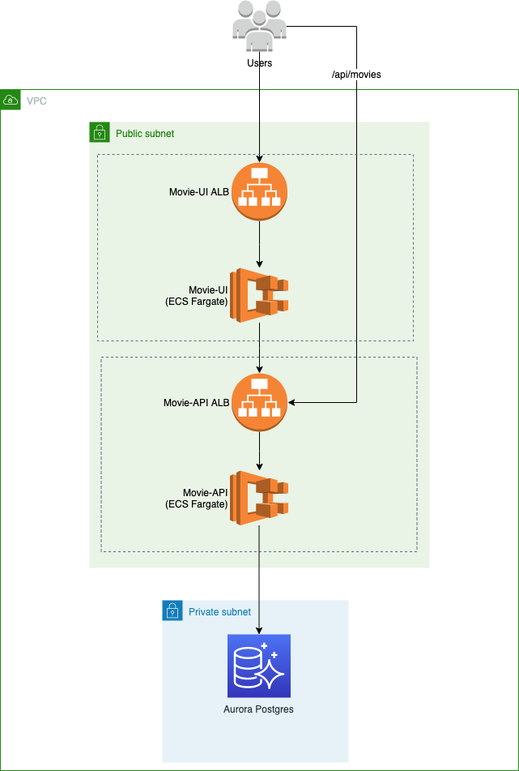

# ACME Movies App

## Description

Demo of a 3-tier, containerized Rails application running on AWS ECS (Fargate) deployed using CDK.

This demo was built to demonstrate how quickly and easily a 3-tiered architecture can be containerized and deployed to AWS without having to understand the intricacies of each service.

## Architecture

**Do *not* run this in production**



### Architecture Decisions

The API communicates with the Postgres DB running on AWS. This can be tested locally before pushing to AWS. The DB configuration is all externalized as a Environment Variables (See [movie-api/config/database.yml](./movie-api/config/database.yml)). The UI needs the API's endpoint passed in as an environment variable as well.

Using environment variables allows the container to be truly portable without having to manage/generate .env files, master.keys and rails credentials.

On AWS the DB values and API endpoint are stored in Parameter Store. ECS automatically populates these values during the container runtime and removing that burden from the developers.

### Improvements

* Move ECS tasks to private subnet. Only ALBs should be in public subnet.
* Use a single ALB with path based routing to route all API calls to the appropriate target group.
* Use AWS Secrets Manager for all DB details.
* Deploy to a single ECS cluster

## Instructions

### Pre-Requisites

***Only tested on macOS***

* Rails 7.0.2.2
* ruby 3.1.0p0 (2021-12-25 revision fb4df44d16) [x86_64-darwin21]
* node v16.5.0
* npm 8.5.0
* Docker
* Docker compose
* AWS CDK
* Typescript
* AWS Account with a VPC and public/private subnets.

### 1. Deploying the database

Todo

### 2. Deploying the applications

We use CDK's ECS Patterns to simplify the deployment of this stack. CDK will automatically provision the following:

* Docker image
* ECR repository
* ECS Cluster
* ECS Task Definition
* ECS Service
* Security groups that only allow traffic on the container port
* ALBs (Load balancers)
* Target groups
* CloudWatch Log Groups (for logs)

This makes it very easy to integrate the solution within your CICD platform.

#### Movie Sample 

##### Movie API

1. Generate a new secret by running rake secret copy the output
```sh
rake secret
```

2. Setup credentials by running. Add the value from step 1 as the value of the 'secret_key_base' key in the file.

```sh
EDITOR="vim" bin/rails credentials:edit --environment production
```

This command will generate the production master key and encoded credentials in config\credentials. 

3. Store the value in 'production.key' as a secret in AWS ParameterStore and pass it to the container as an environment variable.Create a secure string parameter called: /acme/demo/api/movie/key 

4. Create and seed the Postgres DB. Look at the docker-compose.yml file and export the necessary env vars.

```sh
bin/rake db:drop
bin/rake db:create
bin/rake db:migrate
bin/rake db:seed
```
5. To test locally

```sh
export MOVIE_API_DATABASE_USERNAME=postgres
export MOVIE_API_DATABASE_PASSWORD=########
export MOVIE_API_DATABASE_PORT=5432
export RAILS_SERVE_STATIC_FILES=true
export RAILS_MASTER_KEY=########

RACK_ENV=production bundle exec rails s -b 0.0.0.0 -p 3000
```

Validate by visiting [http://localhost:3000/api/movies](http://localhost:3000/api/movies)

##### Movie UI

1. Generate a new secret by running rake secret copy the output
```sh
rake secret
```

2. Setup credentials by running. Add the value from step 1 as the value of the 'secret_key_base' key in the file.

```sh
EDITOR="vim" bin/rails credentials:edit --environment production
```

This command will generate the production master key and encoded credentials in config\credentials. 

3. Store the value in 'production.key' as a secret in AWS ParameterStore and pass it to the container as an environment variable.Create a secure string parameter called: /acme/demo/ui/movie/key 

4. For movie-ui export SECRET_KEY_BASE. See config/secrets.yml

5. Run
```sh
./bin/rails javascript:install:esbuild    
```
6. To test locally

```sh
export REACT_APP_API_URL=http://localhost:3000
export RAILS_MASTER_KEY=########

RACK_ENV=production bundle exec rails s -b 0.0.0.0 -p 3001
```
Validate by visiting [http://localhost:3001/](http://localhost:3001/)

### Docker Compose

In case you want to test this locally a docker-compose file is provided.

Set these values in [docker-compose.yml](./docker-compose.yml)

```sh
  - MOVIE_API_DATABASE_HOST=xxxxxx
  - MOVIE_API_DATABASE_USERNAME=xxxxxx
  - MOVIE_API_DATABASE_PASSWORD=xxxxxx
  - MOVIE_API_DATABASE_PORT=xxxxxx
  - RAILS_SERVE_STATIC_FILES=true
```

Start the containers:

```sh
docker-compose up
```

Test the API by visiting [http://localhost:3000/api/movies](http://localhost:3000/api/movies)
Test the UI by visiting [http://localhost:3001/](http://localhost:3001/)

##### Movie API infrastructure

Edit [cdk.ts](./movie-api-infra/bin/cdk.ts) and set your AWS Account Id and region.

```ts
const envCA  = { account: 'xxxxx', region: 'ca-central-1' }
```

Edit [cdk-stack.ts](./movie-api-infra/lib/cdk-stack.ts) and set your VPC Id. This VPC must exist in the same AWS account and region.

```ts
vpcId: 'vpc-xxxxx'
```

Run:

```sh
cd movie-api-infra
run npm build
cdk deploy
```

#### Movie UI infrastructure

Edit [cdk.ts](./movie-api-infra/bin/cdk.ts) and set your AWS Account Id and region.

```ts
const envCA  = { account: 'xxxxx', region: 'ca-central-1' }
```

Edit [cdk-stack.ts](./movie-api-infra/lib/cdk-stack.ts) and set your VPC Id. This VPC must exist in the same AWS account and region.

```ts
vpcId: 'vpc-xxxxx'
```

Run:

```sh
cd movie-ui-infra
run npm build
cdk deploy
```

